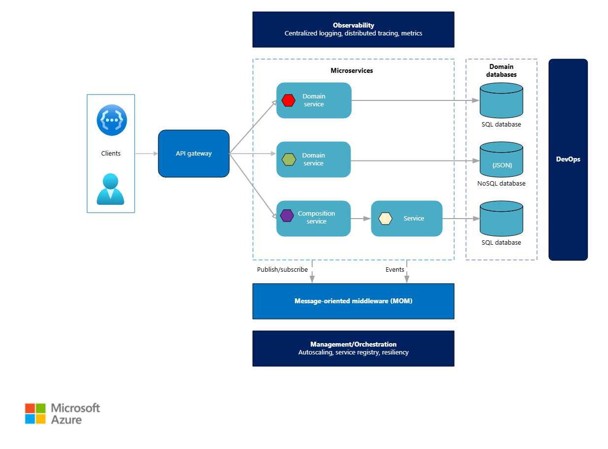

# Microservicios

La arquitectura no está centralizada en un solo lugar. Todo lo que se hace en la aplicación se subdivide en servicios autónimos, uno sin depender de otro. Propio modelo, propia lógica de negocio y propia base de datos.
Usa APIs como intermediaria.

## Ventajas

Hace que el desarrollo sea más ágil ya que se puede separar más facil por responsabilidades.
Es más escalable debido a que en caso dado de aumento de demanda en un solo servicio, pueden crearse más instancias de este sin escalar el proyecto completo.
Si una parte de la aplicación deja de funcionar, el resto sigue funcionando.

## Desventajas

Complejidad que puede alcanzar. Se pueden producir fallos de comunicación, puede requerir mayor infraestructura.
