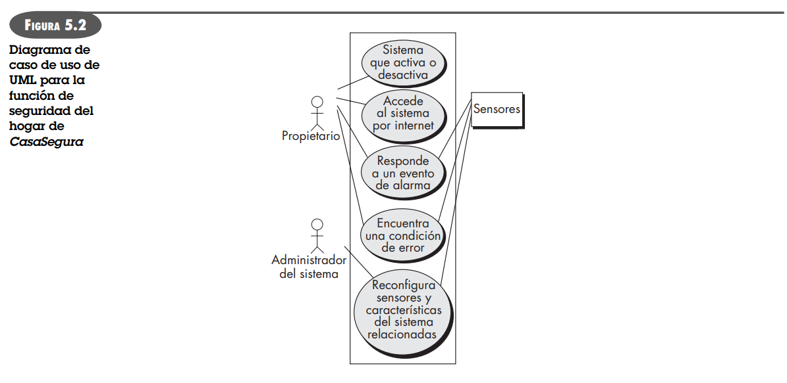
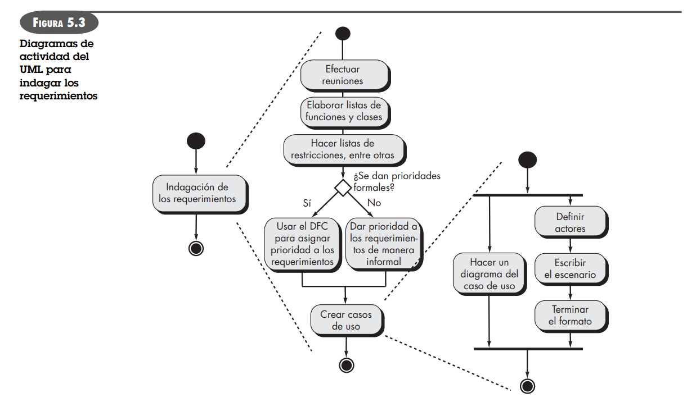
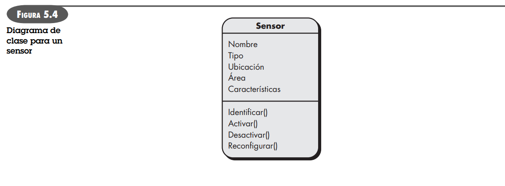
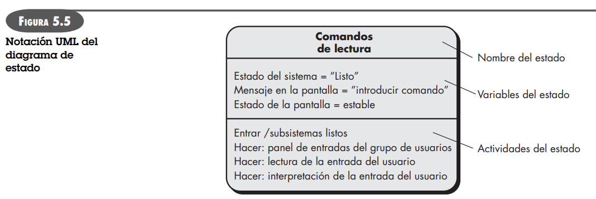

# Requerimientos

## Funcionales

Es una funcionalidad que el sistema debe cumplir, como registrar usuarios o generar reportes.

## No funcionales

Es una característica del sistema relacionada con rendimiento, seguridad o disponibilidad.

# Lista de verificación para validar requerimientos

- ¿Los requerimientos están enunciados con claridad? ¿Podrían interpretarse mal?
- ¿Está identificada la fuente del requerimiento (por ejemplo, una persona, reglamento o documento)? ¿Se ha estudiado el planteamiento final del requerimiento en comparación con la fuente original?
- ¿El requerimiento está acotado en términos cuantitativos?
- ¿Qué otros requerimientos se relacionan con éste? ¿Están comparados con claridad por medio de una matriz de referencia cruzada u otro mecanismo?
- ¿El requerimiento viola algunas restricciones del dominio?
- ¿Puede someterse a prueba el requerimiento? Si es así, ¿es posible especificar las pruebas (en ocasiones se denominan criterios de validación) para ensayar el requerimiento?
- ¿Puede rastrearse el requerimiento hasta cualquier modelo del sistema que se haya creado?
- ¿Es posible seguir el requerimiento hasta los objetivos del sistema o producto?
- ¿La especificación está estructurada en forma que lleva a entenderlo con facilidad, con referencias y traducción fáciles a productos del trabajo más técnicos?
- ¿Se ha creado un índice para la especificación?
- ¿Están enunciadas con claridad las asociaciones de los requerimientos con las características de rendimiento, comportamiento y operación? ¿Cuáles requerimientos parecen ser implícitos?

# Fases

## Reunión para recabar requerimientos

### General

Se toman los objetivos del sistema, se identifican módulos y con cada equipo se dan reuniones para entender cada fase del sistema. Suele haber tres partes. Facilitador, Técnicos y Usuarios.

### Escenarios de uso

Empiezan a identificarse como usarán el sistema los distintos clientes.

## Caso de uso de alto nivel

## Diagrama de actividades

## Diagrama de clase

## Diagrama de estado

## Especificación caso de uso
